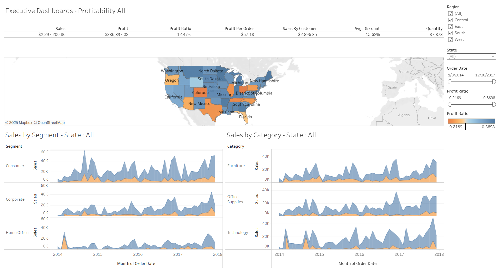

# Superstore-Analysis-2014-2017-
Business insights on a superstore giant visualized with Tableau
The goal of this project is to look into a sample dataset of a superstore and tell a story through data visualization for the store managers to create actionable insights.
## Dataset Structure
Below are the info of each column of the dataset used for the data visualization.
| Column Name   | Description |
|---------------|-------------|
| Row ID        | Unique ID for each row. |
| Order ID      | Unique Order ID for each customer. |
| Order Date    | Order date of the product. |
| Ship Date     | Shipping date of the product. |
| Ship Mode     | Shipping mode specified by the customer. |
| Customer ID   | Unique ID to identify each customer. |
| Customer Name | Name of the customer. |
| Segment       | The segment where the customer belongs. |
| Country       | Country of residence of the customer. |
| City          | City of residence of the customer. |
| State         | State of residence of the customer. |
| Postal Code   | Postal code of the customer. |
| Region        | Region where the customer belongs. |
| Product ID    | Unique ID of the product. |
| Category      | Category of the product ordered. |
| Sub-Category  | Sub-category of the product ordered. |
| Product Name  | Name of the product. |
| Sales         | Sales value of the product. |
| Quantity      | Quantity of the product. |
| Discount      | Discount provided. |
| Profit        | Profit or loss incurred. |

# Superstore Performance Evaluation

In order to evaluate store performance, we focused on the following key metrics:

- **Sales**: Total revenue generated from all orders.  
- **Profit**: Total profit after accounting for discounts and costs.  
- **Profit Ratio**: Profit as a percentage of sales.  
- **Profit per Order**: Average profit generated per individual order.  
- **Sales per Customer**: Average total sales generated per unique customer.  
- **Discount (Amount)**: Total monetary value of discounts given, not percentages.  
- **Quantity**: Total units of products sold.

### Sales
Across all regions, the **West** region generated the highest sales (`$725K`), exceeding its sales target by 11%.  
The **East** region followed with `$679K` but fell short of its target by 23%.  
Despite having the lowest sales (`$392K`), the **South** region had a relatively balanced product mix and moderate discount usage.

### Profit
The **West** region led profitability with `$108K` profit and a healthy profit ratio, driven by strong sales in Office Supplies and reduced discounting.  
The **Central** region had the lowest profit (`$39K`), despite selling over `$500K` in products — indicating **margin erosion** likely due to higher discounts and low-margin product sales.

### Profit Ratio
- **Highest**: West region, benefiting from premium products and controlled discounting.  
- **Lowest**: Central region, where aggressive discounting and low-margin categories reduced profitability.  
A consistent pattern shows that **Furniture** has a much lower profit ratio compared to Office Supplies and Technology.

### Profit per Order
Orders from **Corporate** segment customers had the highest profit per order, suggesting stronger willingness to pay for high-value items.  
**Home Office** customers, while having fewer orders, maintained steady profitability with niche product purchases.

### Sales per Customer
**Consumer** segment customers drove the highest total sales but required more volume to achieve similar profits compared to Corporate customers.  
The West region’s strong customer loyalty and repeat purchases helped maintain high sales per customer.

### Discount
Total discounts given across all regions exceeded **$358K**, with **Furniture** absorbing the largest portion.  
High discounting in this category reduced profit margins substantially, particularly in large-ticket items like Tables and Bookcases.

### Quantity
Office Supplies accounted for the largest quantity of units sold, driving volume-based revenue but not necessarily the highest profits.  
Technology products, though fewer in quantity, generated higher profits per unit sold.

### Recommendations

1. **Replicate West’s Sales Model**  
   Leverage West region’s sales and discounting strategies in underperforming regions, particularly East and Central.

2. **Reduce Discounting on Low-Margin Categories**  
   Furniture should be prioritized for discount control to protect margins. Use data to identify price-sensitive vs. value-driven customers.

3. **Focus on High-Profit Segments**  
   Increase marketing and upselling to **Corporate customers** who have higher profit per order and better ROI.

4. **Optimize Product Mix by Region**  
   Tailor each region’s product portfolio to emphasize high-margin categories like Technology while managing inventory for bulk but low-margin items.

5. **Monitor Profit Ratio Trends**  
   Track profit ratio by product and region monthly to spot early warning signs of margin decline.

# Dashboard
The dashboard can be found in Tableau Public [here](https://public.tableau.com/app/profile/aiden.awal.maulana/viz/SuperstoreDashboard_17548856643620/ExecutiveDashboard#1).
This dashboard enables users to filter by Region, State, Order Date, and Profit Ratio. The dashboard focuses on the sales trend of product category and customer segment from 2014-2017 for Executives.

